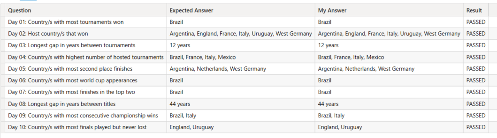

# 25 days of DAX Fridays! Challenge – Ed2: World Cup

En este repositorio puedes encontrar mi código DAX para resolver las preguntas del reto **25 days of DAX Fridays! Challenge – Ed2: World Cup** creado por Ruth Pozuelo (Curbal)

Esta es la página del reto:
https://curbal.com/25-days-of-dax-fridays-challenge-ed2-world-cup-data

Todas las respuestas están en el fichero  **25 Days DAX Ed2 World Cup.dax** que puede ser ejecutado en DAX Studio.

Si quieres usarlo, tienes que tener un PBIX con el modelo creado siguiendo las indicaciones de Ruth. Además debes crear en ese modelo la tabla 'Answers' porque en el fichero se crea una medida en esa tabla para cada respuesta.

Al ejecutar el fichero en DAX Studio se obtiene una tabla como la que se muestra en la imagen, donde cada fila tiene la pregunta, la respuesta esperada, mi respuesta y una última columna indicando si mi respuesta coincide con la respuesta esperada.

También puedes descargar el fichero **25 Days DAX Ed2 World Cup - Questions.dax** que tiene las pregunstas y las respuestas esperadas, pero las medidads para cada pregunta están vacías, para que las puedas completar.

